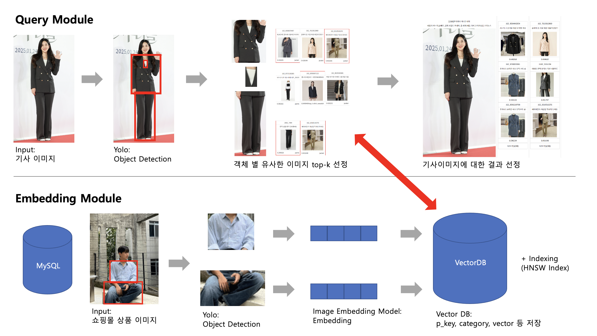
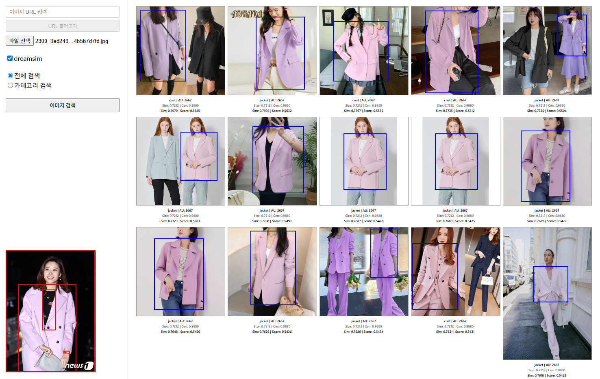

# AISUM — 이미지 임베딩 기반 유사상품 검색 (모델 벤치마크)

이미지 기반 유사상품 검색 시스템 구축을 위해, 다양한 이미지 임베딩 모델과 벡터 저장 방식을 비교·검증하는 리서치 단계의 코드입니다.

## Overview

- 다수의 이미지 임베딩 백본 모델을 후보로 두고 성능 비교
- 벡터 인덱스 저장 방식 2종(FAISS / PostgreSQL+pgvector) 병행 실험
- 상품 이미지(레퍼런스) ↔ 후보 이미지 간 유사도 기반 매칭 검증

## Pipeline



- **Query Module**: 기사 이미지 입력 → 객체 검출(YOLO) → 객체별 유사 이미지 top-k 선정 → 최종 결과 선정
- **Embedding Module**: 쇼핑몰 상품 이미지(MySQL 연동) → 객체 검출 → 이미지 임베딩 → 벡터 DB 인덱싱(HNSW)

## Demo



이미지 URL 입력 시, 객체 검출된 영역별로 유사 상품을 유사도(Score) 순으로 반환하는 검색 화면 예시입니다.

## Project Structure

```
.
├── dataset.py                  # 이미지 데이터셋 로더
├── download_images.py          # MySQL 상품 DB에서 이미지 다운로드
├── image_embedding_model.py    # 임베딩 모델 로딩 및 추론
├── index_builder.py            # 이미지 임베딩 후 벡터 인덱스 구축
├── product_matching.py         # 유사 상품 매칭/검색 실행
├── vector_database.py          # FAISS 기반 벡터 인덱스
├── pgvector_database.py        # PostgreSQL + pgvector 기반 벡터 저장소
└── models/                     # 임베딩 모델 구현체
```

## Features

- **임베딩 모델 비교**: CNN 계열(ResNet, ResNeXt 등)과 Transformer/멀티모달 계열(ViT, MagicLens 등) 백본을 동일한 파이프라인에서 교체 실험 가능
- **벡터 저장소 비교**: 로컬 인덱스(FAISS)와 DB 기반 저장소(pgvector) 두 방식으로 검색 성능·운용성 비교
- **상품 매칭 검증**: 레퍼런스 이미지와 후보 이미지 간 유사도 계산 및 매칭 결과 확인

## Requirements

```
torch
faiss-cpu (또는 faiss-gpu)
psycopg2
pillow
numpy
```

## Usage

```bash
# 1. 상품 이미지 다운로드
python download_images.py

# 2. 임베딩 인덱스 구축
python index_builder.py

# 3. 유사 상품 매칭 실행
python product_matching.py
```

사용할 임베딩 모델 및 벡터 저장소(FAISS/pgvector)는 각 스크립트 상단 설정값에서 변경합니다.

## Notes

- 본 저장소는 서비스화 이전 단계의 리서치용 코드로, 실제 API 서버는 포함되어 있지 않습니다.
- DB 접속 정보 등 민감 정보는 커밋 전 반드시 확인 및 분리가 필요합니다.
